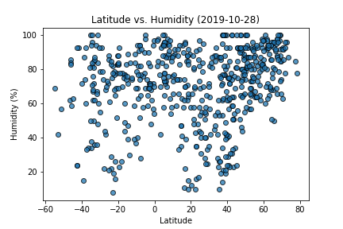
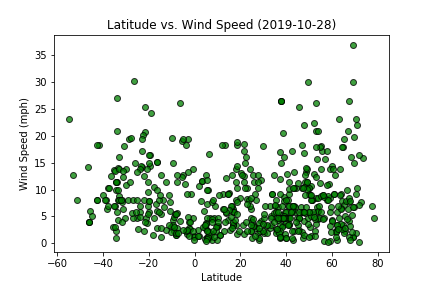
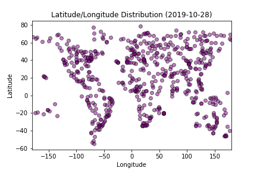
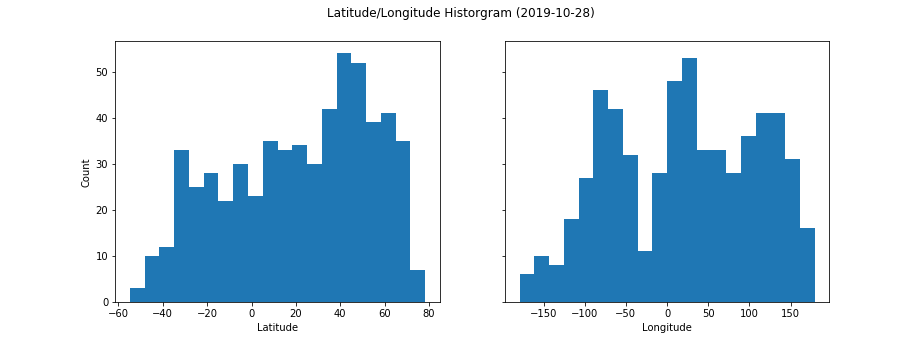

# Assignment Background: What's the Weather Like?

The basis for this project was analyzing weather trends across latitudes using Python, Matplotlib plots, and API calls to acquire data. Once an [OpenWeatherMap](https://openweathermap.org/) API key is supplied to the keys file, this program will generate a list of randomly selected cities, use those cities to make API calls to pull weather data, and populate a dataframe with the weather data for analysis. After the data is collected, the dataframe is then cleaned and saved to [cities.csv](Outputs/cities.csv).

The plots that follow were used to find trends between Latitude and select weather parameters: Temperature, Humidity, Cloudiness, and Wind Speed.

API Plots             |  (Powered by OpenWeatherMap)
:-------------------------:|:-------------------------:
 |  
 |  

 I also plotted the Lat/Long points to see the data point distribution visually, as this roughly renders points as a map.

 

 I also plotted a Lat/Long histogram to see the distribution of my data, to find regions that may be overrepresented or underrepresented.

----

# Analysis

### Trend 1: 
For this randomly selected dataset, I found that max temperatures tend to decrese with increasing latitude, peaking at ~25 degrees latitude. That being said, the positive latitudinal half accounts for the majority of the data, as the Northern Hemisphere has a majority of the landmass. Cloudiness follows a similar trend in the Northern Hemisphere as well, and this may again be attributed to the larger amount of landmass in the Northern Hemisphere.

### Trend 2:
Low humidity areas tend to be closer to the equator, with some of the lowest humidity readings coming from between 20-30 degrees North or South of the equator. Lowest humidities tend to go to higher percents outside of the 20-30 degree (North/South). Otherwise, humidity tends to be < 60% for most reported latitudes. Windiness does not appear to have a strong correlation with latitudes.

### Trend 3:
With over 500 data points, I am able to get a set of data that's well distributed across the continents. That being said, there are some holes in the data. Certain regions of continents don't tend to appear in the data set, and most of these are in scarcely inhabited or uninhabitable areas such as the Amazon Rainforest, Sahara Desert, the outback of Austrailia, and Northern regions of Northern Hemisphere continents. Throughout this project, I regularly saw holes in my Latitude/Longitude
data distribution. 

## Copyright

Data Boot Camp © 2018. All Rights Reserved.
