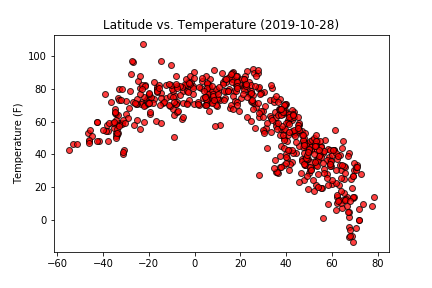
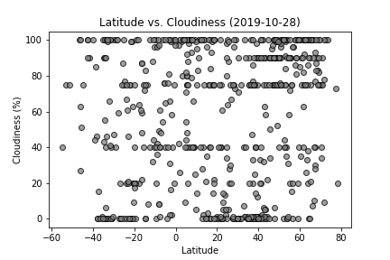

# Assignment Background: What's the Weather Like?

The basis for this project was analyzing weather trends across latitudes using Python, Matplotlib plots, and API calls to acquire data. Once an [OpenWeatherMap](https://openweathermap.org/) API key is supplied to the keys file, this program will generate a list of randomly selected cities, use those cities to make API calls to pull weather data, and populate a dataframe with the weather data for analysis. After the data is collected, the dataframe is then cleaned and saved to [cities.csv](Outputs/cities.csv).

The plots that follow were used to find trends between Latitude and select weather parameters: Temperature, Humidity, Cloudiness, and Wind Speed.

Solarized dark             |  Solarized Ocean
:-------------------------:|:-------------------------:
 |  
 |  

 I also plotted the Lat/Long points to see the data point distribution visually, as this roughly renders points as a map.

 

 I also plotted a Lat/Long histogram to see the distribution of my data, to find regions that may be overrepresented or underrepresented.

## WeatherPy

In this example, you'll be creating a Python script to visualize the weather of 500+ cities across the world of varying distance from the equator. To accomplish this, you'll be utilizing a [simple Python library](https://pypi.python.org/pypi/citipy), the [OpenWeatherMap API](https://openweathermap.org/api), and a little common sense to create a representative model of weather across world cities.

Your objective is to build a series of scatter plots to showcase the following relationships:

* Temperature (F) vs. Latitude
* Humidity (%) vs. Latitude
* Cloudiness (%) vs. Latitude
* Wind Speed (mph) vs. Latitude

Your final notebook must:

* Randomly select **at least** 500 unique (non-repeat) cities based on latitude and longitude.
* Perform a weather check on each of the cities using a series of successive API calls.
* Include a print log of each city as it's being processed with the city number and city name.
* Save both a CSV of all data retrieved and png images for each scatter plot.

As final considerations:

* You must complete your analysis using a Jupyter notebook.
* You must use the Matplotlib or Pandas plotting libraries.
* You must include a written description of three observable trends based on the data.
* You must use proper labeling of your plots, including aspects like: Plot Titles (with date of analysis) and Axes Labels.
* See [Example Solution](WeatherPy_Example.pdf) for a reference on expected format.

## Hints and Considerations

* The city data is generated based on random coordinates; as such, your outputs will not be an exact match to the provided starter notebook.

* You may want to start this assignment by refreshing yourself on the [geographic coordinate system](http://desktop.arcgis.com/en/arcmap/10.3/guide-books/map-projections/about-geographic-coordinate-systems.htm).

* Next, spend the requisite time necessary to study the OpenWeatherMap API. Based on your initial study, you should be able to answer  basic questions about the API: Where do you request the API key? Which Weather API in particular will you need? What URL endpoints does it expect? What JSON structure does it respond with? Before you write a line of code, you should be aiming to have a crystal clear understanding of your intended outcome.

* A starter code for Citipy has been provided. However, if you're craving an extra challenge, push yourself to learn how it works: [citipy Python library](https://pypi.python.org/pypi/citipy). Before you try to incorporate the library into your analysis, start by creating simple test cases outside your main script to confirm that you are using it correctly. Too often, when introduced to a new library, students get bogged down by the most minor of errors -- spending hours investigating their entire code -- when, in fact, a simple and focused test would have shown their basic utilization of the library was wrong from the start. Don't let this be you!

* Part of our expectation in this challenge is that you will use critical thinking skills to understand how and why we're recommending the tools we are. What is Citipy for? Why would you use it in conjunction with the OpenWeatherMap API? How would you do so?

* In building your script, pay attention to the cities you are using in your query pool. Are you getting coverage of the full gamut of latitudes and longitudes? Or are you simply choosing 500 cities concentrated in one region of the world? Even if you were a geographic genius, simply rattling 500 cities based on your human selection would create a biased dataset. Be thinking of how you should counter this. (Hint: Consider the full range of latitudes).

* Lastly, remember -- this is a challenging activity. Push yourself! If you complete this task, then you can safely say that you've gained a strong mastery of the core foundations of data analytics and it will only go better from here. Good luck!

----
# Analysis

### Trend 1: 
For this randomly selected dataset, I found that max temperatures tend to decrese with increasing latitude, peaking at ~25 degrees latitude. That being said, the positive latitudinal half accounts for the majority of the data, as the Northern Hemisphere has a majority of the landmass. Cloudiness follows a similar trend in the Northern Hemisphere as well, and this may again be attributed to the larger amount of landmass in the Northern Hemisphere.

### Trend 2:
Low humidity areas tend to be closer to the equator, with some of the lowest humidity readings coming from between 20-30 degrees North or South of the equator. Lowest humidities tend to go to higher percents outside of the 20-30 degree (North/South). Otherwise, humidity tends to be < 60% for most reported latitudes. Windiness does not appear to have a strong correlation with latitudes.

### Trend 3:
With over 500 data points, I am able to get a set of data that's well distributed across the continents. That being said, there are some holes in the data. Certain regions of continents don't tend to appear in the data set, and most of these are in scarcely inhabited or inhabitable areas such as the Amazon Rainforest, Sahara Desert, the outback of Austrailia, and Northern regions of Northern Hemisphere continents. Throughout this project, I regularly saw holes in my Latitude/Longitude
data distribution. 

## Copyright

Data Boot Camp © 2018. All Rights Reserved.
